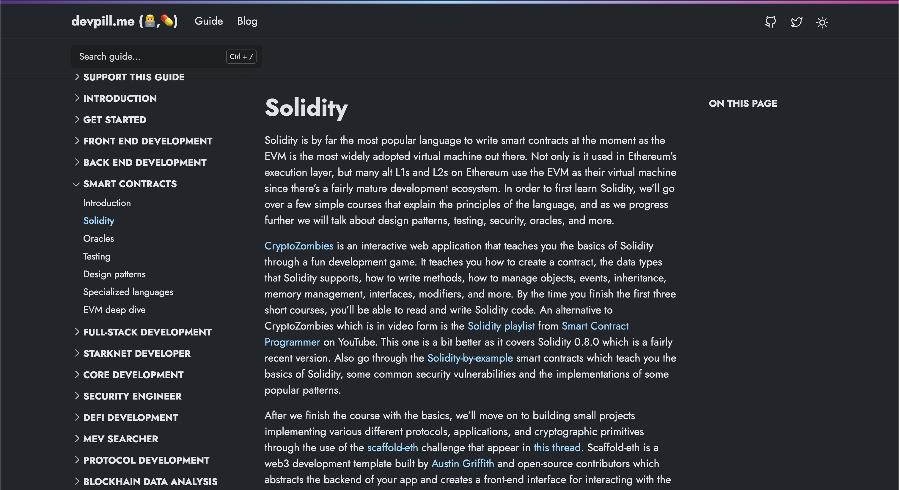

## What is devpill.me?

[devpill.me](https://www.devpill.me/) is a public good blockchain development guide aimed at becoming the go-to learning resource aggregator for web3 development.

The go-to educational resource for blockchain developers to learn no matter their skill level. The guide is beginner-friendly, but the most skilled developers will find learning material as well. It has various different specializations (or tracks), the two main categories are skill-based (front end, back end, smart contracts, MEV searcher, core developer, ...) and application-based specializations (DeFi, gaming, creator economy, coordination / public goods, etc). The goal of this grant is to gather enough resources to incentivize different contributors to create the sections in which they are skilled and allow the community to curate and maintain the resource long term. The resources will also be used to create a custom UI for the guide and additional learning materials in order to create the most complete blockchain development learning resource in existence.

## Table of contents

- [Support this guide](https://www.devpill.me/docs/support)
- [Introduction](https://www.devpill.me/docs/introduction/foreword/)
- [Get started](https://www.devpill.me/docs/get-started/introduction/)

### Skill-based development

- [Frontend development](https://www.devpill.me/docs/front-end-development/introduction/)
- [Backend blockchain development](https://www.devpill.me/docs/back-end-development/introduction/)
- [Smart contract development](https://www.devpill.me/docs/smart-contract-development/introduction/)
- [Core protocol development](https://www.devpill.me/docs/core-development/introduction/)
- [Full-stack blockchain development](https://www.devpill.me/docs/full-stack-development/introduction/)
- [Starknet developer](https://www.devpill.me/docs/starknet-development/wip/)
- [Cryptography](https://www.devpill.me/docs/cryptography/introduction/)

### Additional sections

- [Getting a job](https://www.devpill.me/docs/getting-a-job/introduction/)
- [Social Capital](https://www.devpill.me/docs/social-capital/wip/)
- [Mastery](https://www.devpill.me/docs/mastery/wip/)

## Support this public good

- [Gitcoin grants](https://gitcoin.co/grants/4975/devpillme-a-public-good-blockchain-development-gu)
- [Mirror NFTs](https://dcbuilder.mirror.xyz/PLNPOmKkYaP14kJa5A5pJgyIlg4dWHpjDiHS7BGC7J4)
- Donation to [devpillme.eth](https://app.ens.domains/name/devpillme.eth/details) Ethereum address - (also on Optimism, Arbitrum, zkSync and Polygon PoS)

## Get started

### Install dependencies

```bash
yarn install
```

### 3. Start development server

```bash
yarn start
```

This site is built using the [Doks](https://github.com/h-enk/doks) theme for [HUGO](https://gohugo.io/), hosted on [Vercel](https://vercel.com/). Once first iteration is finished will be deployed to IPFS/Arweave and GitHub actions will redeploy on commit to main. 
